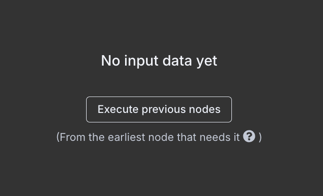

+++
lastmod = '2025-05-09T14:39:04+08:00'
date = 2025-05-30
draft = false
title = '我在現實生活中用 n8n 開外掛(1) - 在本地環境安裝 n8n'
tags = ['n8n', '自動化']
topics = ['我在現實生活中用 n8n 開外掛']
+++

## 前言

`n8n`作為一套自動化管理工具，目前在`GitHub`上有超過 4 萬顆星星，十分火熱，而肥宅我也想朝聖，一睹`n8n`
的魅力，於是有了這些筆記的出現。這一系列的文章會是提供給應用程式開發已有基礎的朋友們，讓你們能夠快速上手`n8n`
的使用，並且能夠在日常生活中使用`n8n`來幫助完成工作。

### **使用工具**

在這邊文章中，我們會使用這些工具在本地安裝並且設定`n8n`。

- 容器管理工具：[Docker + Docker Compose](https://docs.docker.com/get-started/get-docker/)，MacOS
  上也可以使用 [OrbStack](https://orbstack.dev/dashboard)
    - `OrbStack`是一個 輕量級的`Docker`替代品，它可以在`MacOS`上以更快的啟動速度和更少的資源佔用來執行`Docker`，然而所有可以在
      `Docker`上執行的容器操作，`OrbStack`也可以使用。時至今日目前只有版本可以使用。
- 準備你的編輯器，可以是 VSCode 或者是 JetBrains 的 IDE

## 拿出你的鍵盤吧！

### **容器配置圖**

如下圖，`n8n`與`postgresSQL`是我們預計啟用的 Docker containers，在使用者的工作過程中，`n8n` 會寫入或讀取資料於資料庫
`postgresSQL`上。  
當我們啟動`n8n`後，可透過瀏覽器訪問`n8n`的工作介面，並且在上面設置工作流程，這些工作流程會在`n8n`的容器中運行。


    flowchart LR
        A[使用者]
        B[n8n]
        C[(postgresSQL)]
        subgraph "Docker containers"
            B <--> C
        end
        A -- 瀏覽器 --> B


### **開始安裝**

1. 下載 Docker Desktop，並且安裝。
2. 建立一個空白專案資料夾並新增下列檔案給 Docker 容器配置使用。Docker 配置檔案是從`n8n`
   官網取得，如需瞭解更多，請參考[這裡]( https://docs.n8n.io/hosting/installation/docker/)。

   ##### **.env**
    ```dotenv
    # Database Configuration
    # PostgreSQL 資料庫的管理者帳號
    POSTGRES_USER=n8n
    # PostgreSQL 資料庫的管理者密碼
    POSTGRES_PASSWORD=n8npass
    # PostgreSQL 資料庫的名稱
    POSTGRES_DB=n8n
    # PostgreSQL 資料庫的連線 port
    POSTGRES_PORT=5432

    # n8n Configuration
    # n8n 對外的連接埠
    N8N_PORT=5678
    # n8n 的 Webhook URL
    WEBHOOK_URL=http://localhost:5678
    ```
   `.env`檔案是用來設定所有`Docker`容器的環境變數，當容器啟動時會讀取這些環境變數給`n8n`使用。

   ##### **docker-compose.yml**
    ```yaml
    services:
        # postgresSQL 資料庫
        postgres:
            image: postgres:15.3-alpine
            restart: always
            ports:
                - "${POSTGRES_PORT:-5432}:5432"
            environment:
                POSTGRES_USER: ${POSTGRES_USER:-n8n}
                POSTGRES_PASSWORD: ${POSTGRES_PASSWORD:-change_this_password}
                POSTGRES_DB: ${POSTGRES_DB:-n8n}
            volumes:
                - n8n_postgres_data:/var/lib/postgresql/data
            networks:
                - n8n_network
    
        # n8n 自動化工作管理工具
        n8n:
            image: n8nio/n8n:latest
            restart: unless-stopped
            ports:
                - "${N8N_PORT:-5678}:5678"
            environment:
                # n8n 主機之設置
                - N8N_RUNNERS_ENABLED=true
                - N8N_HOST=${N8N_HOST:-localhost}
                - N8N_PORT=${N8N_PORT:-5678}
                - WEBHOOK_URL=${WEBHOOK_URL:-http://localhost:5678}
                - GENERIC_TIMEZONE=Asia/Taipei
                - TZ=Asia/Taipei
            depends_on:
                - postgres
            volumes:
                - n8n_data:/home/node/.n8n
            networks:
                - n8n_network
    
    networks:
        n8n_network:
            name: n8n_network
            driver: bridge
    
    volumes:
        n8n_data:
            name: n8n_public_data
    ``` 
   `docker-compose.yml`是用來定義`Docker`的容器配置。這些檔案會在容器啟動時被讀取並且應用到`n8n`的運行環境中。

3. 執行指令啟動 n8n 容器  
   在背景啟動`n8n`與`postgresSQL`的容器：
    ```shell
    $ cd <專案資料夾> && docker-compose up -d
    ```

   執行完成後，可以執行下列指令來檢查容器是否成功啟動：
    ```shell
    $ cd <專案資料夾> && docker compose ps
    ```

   如果容器啟動成功，在回應的訊息中，如紅色框框中所示那樣，狀態為`Up`：
   

   到這一步為止，若容器成功啟動，那麼安裝就已經完成了。

### **訪問 n8n**

[點擊這裡](http://localhost:5678)，或是在瀏覽器的網址列輸入`http://localhost:5678`，即可進入`n8n`的工作介面。

#### **初始設定**

當你第一次進入`n8n`的工作介面時，系統會要求建立一個 Owner account，這個帳號會是你在使用`n8n`時的管理者帳號。


接著可以忽略調查`n8n`的問卷，直接點擊`Get Started`即可。


免費取得永久付費特權，也是可選的步驟。


#### **進入工作介面**

當你完成上述的步驟後，就可以進入`n8n`的工作介面了。


在這邊你可以按下左上角的`+`、右上角的`create workflow`按鈕，或是中間的`Start from scratch`來建立新的工作流程。

### **quickstart 範例**

現在我們參考官網的範例：[Very quick quickstart](https://docs.n8n.io//try-it-out/quickstart/)，來認識一下`n8n`
。這個範例介紹了一些主要特點：工作流程模板（`Workflow templates`）、節點（`Nodes`）與表達式（`Expressions`）。

工作流程模板（`Workflow templates`）是由`n8n`官方或社群成員設計的預建立工作流程，你可以將其導入到你的專案中。
  

節點（`Nodes`）是用來創建工作流程的組件。節點定義了工作流程何時運行，處理數據，定義控制邏輯，並且可以連接外部服務。
  

表達式（`Expressions`）可以讓你在`n8n`的工作介面中注入參數以執行一小段`Javascript`程式碼。


#### **STEP.1 複製工作流程模板**

1. 我們先從n8n官方的樣版庫找到[quickstart](https://n8n.io/workflows/1700-very-quick-quickstart)模板，然後 在網頁中點擊左側的
   `Use for free`按鈕。
   

2. 在彈出的`Use template`視窗中，點擊`Copy template to clipboard[JSON]`按鈕，將範本內容複製到剪貼簿。
   

3. 接著回到`n8n`的工作介面，點擊右上角的`create workflow`按鈕，在畫布上直接按下`Ctrl/Command + V`
   ，將剛剛複製的範本貼到畫布`Canvas`上，接著按下`Ctrl + S`或是右上方儲存按鈕，將本次異動存檔。  
   右上角紅框處可以為工作流程改名稱，`Add tag`則可以為工作流程設置標籤，以便快速搜尋。
   

#### **STEP.2 執行工作流程**
按下模板上`Test workflow`按鈕，即可執行這個工作流程，執行完成時系統會自動通知成功的訊息，且各個節點會在成功通過時標注一個綠色勾勾。


#### **STEP.3 認識工作流程**
以下我們先逐個說明各個節點：

1. `Sticky note`  
   用來做為備註的便利貼，可以在畫布上隨意拖曳、改變大小與顏色。這個元件不會影響工作流程的運行。當滑鼠游標移動到便利貼時，會出現調色盤與垃圾桶的符號，可以用來調整顏色與刪除便利貼。
   

   將滑鼠移動到最右側的`+`符號上，會浮現一個小的新便利貼的按鈕在`+`下方，點擊這個按鈕就會新增一個便利貼。直接按下快速鍵`Shift + S`也可新增一個便利貼。
   

2. `Trigger Manually Node`
   手動觸發器節點。任何一個觸發器節點意味著工作流程起始之處。當模板中有手動觸發器節點時，模板上會出現`Test workflow`按鈕。
   

3. `Customer Database(n8n training)`
   客戶數據資料庫節點。此節點僅用於`n8n`新用戶入門教學。它提供用於測試目的的虛擬數據，沒有其他功能。 
   

4. `Edit Fields (Set)`
   資料編輯節點。此節點用於修改數據的欄位。當工作流程運行時，這個節點會將前一個節點輸出的數據進行修改。
   

#### **STEP.4 一點點變化**
現在我們來修改一下工作流程，跟著官網的範例來加入一個新的節點：`Customer Messenger`。
1. 點擊`Edit Fields (Set)`右側的`+`按鈕，然後在搜尋欄中輸入`Customer Messenger`，找到這個節點後點擊它。
   

2. 點擊後會直接開始編輯`Customer Messenger`的內容。左側`input`面板中的`Schema`tab會載入前面節點的輸出資料。
   

   
   若左側`input`面板顯示了`No input data yet`，代表目前從未執行過工作流程，這時只要點擊`Execute previous nodes`按鈕，先執行過前面的工作流程，這樣就會有資料進來了。
   
   

3. 自左側`input`面板上，拖曳`Edit field1` > `customer_id`至中間面板的`Customer ID`欄位中，這時會自動填入一些文字`{{ $json.customer_id }}`，代表`n8n`為我們填入一個表達式，目的是引用自上一個節點傳入的數值。
    

4. 將滑鼠移到中間面板的`Message`欄位並停在上面，會發現欄位的右上角出現兩個按鈕`fixed`與`expression`，點擊`expression`按鈕後，欄位前面會長出一個`fx`的區塊，代表我們可以在欄位中輸入表達式。  
   將這段內容填入到欄位中，這時下方`Result`區塊也會動態地產生可能的輸出內容：
   ```html
   Hi {{ $json.customer_name }}. Your description is: {{ $json.customer_description }}
   ```
5. 直接點擊中間面板的`Test step`按鈕，這時會看見右側`output`面板中出現了輸出結果，這個結果會是我們剛剛在`Message`欄位中輸入的表達式所處理後的結果。

## 小結
在這篇文章中，我們學習了如何在本地環境安裝`n8n`，並且簡單地認識了`n8n`的工作流程、節點與表達式。接下來的文章中，我們將會深入探討如何使用`n8n`。
